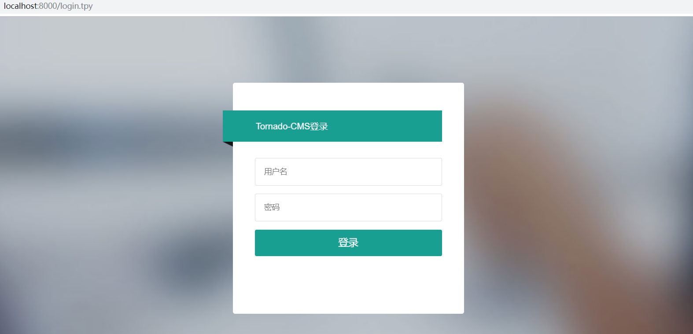
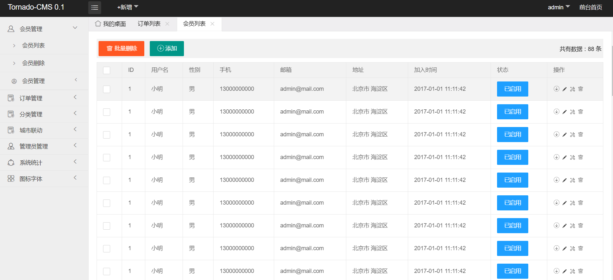

# tornado-cms
计划使用tornado作为web服务器开发一个企业级内容管理框架

# 自动装配置Handher
把写好的Handher放入到app/handher程序即可生成相应的url地址 
Handher中使用的函数在PARAMETERS = init()中完成初始化

# 静态文件处理
* 此架构装配了文件处理FileHandher
* 把要使用的静态文件放到public目录即可访问

# 交流群
* qq群号：940742391 

# tornado-cms
Build a Reliable Asynchronous Python Web Content Management Server

*运行
python main.py

登录页面

列表样例

